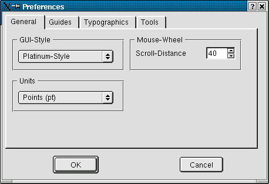
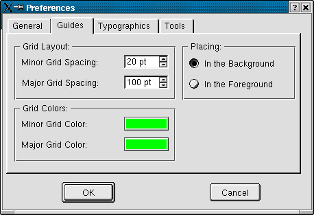
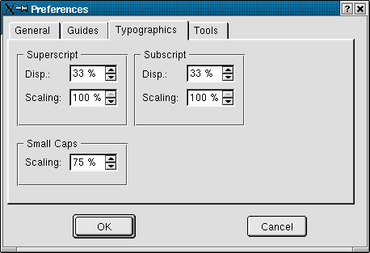
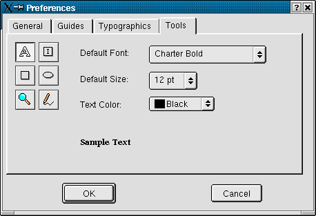

# 2.3 Programmweite Einstellungen

Im Menü "Edit" finden Sie den Punkt "Preferences". Hier können Sie folgende Einstellungen vornehmen:

## 2.3.1 General

Unter "GUI-Style" (Graphical User Interface) können Sie das Aussehen von Menüs, Buttons und anderen
Elementen der Benutzeroberfläche anpassen. Es stehen mehrere Definitionen zur Auswahl, unter anderem
auch ein "Windows-like"-Style.

"Units" stellt die Standard-Maßeinheit ein. Momentan habe Sie die Wahl zwischen "pt" (Points) und
"mm" (Millimeter).

Wenn Sie über eine Maus mit Scroll-Rädchen verfügen können Sie unter "Mouse-Wheel" die Scrollgenauigkeit
einstellen.

## 2.3.2 Guides

Hier können Sie die Einstellungen der Hilfslinien vornehmen. Anschließend können diese über den Menüpunkt
"View / Show Guides" ein- bzw. ausgeblendet werden (siehe auch Punkt 3.2, "Elemente einer Seite").

Stellen Sie die Abstände der Linien zueinander ("Grid Layout") und deren Farbe ("Grid Colors") ein. Das Gitter
kann entweder im Vordergrund vor allen anderen Scribus-Elementen (Rahmen, Linien etc.) oder hinter diesen
plaziert werden.

## 2.3.3 Typographics

Der Abstand und die Größenskalierung für hoch- bzw. tiefer-gestellten Text relativ zum Stamm-Text
werden hier eingestellt. Kapitälchen ("Small Caps") könnnen ebenfalls relativ zum Stamm-Text skaliert werden.

## 2.3.4 Tools

Sechs Werkzeuge aus der Werkzeug-Leiste (siehe auch Punkt 2.2.1 "Die Werkzeugleiste") können hier vorkonfiguriert
werden
