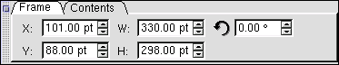
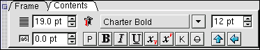
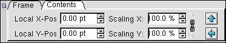
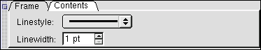
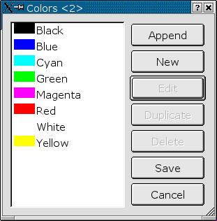
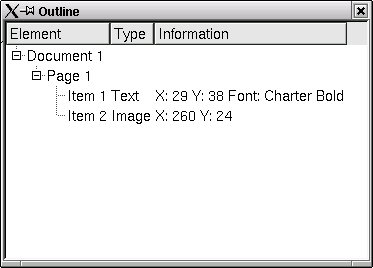

# 2.2 Die Leisten

Unter dem Menüpunkt View können Sie sich die Werkzeugleisten von Scribus einblenden lassen.

## 2.2.1 Die Werkzeugleiste

-  Verschiebt Rahmen und andere Objekte auf einer Seite
-  Dreht einen Rahmen oder ein anderes Scribus-Objekt
-  Wechselt in den Bearbeitungsmodus eines Rahmens
-  Zoomt in einem Dokument, bei gedrückter SHIFT-Taste wird ausgezoomt
-  Einen neuen Textrahmen auf der Seite plazieren
-  Einen neuen Bildrahmen auf der Seite plazieren
-  Ein Rechteck aufziehen
-  Eine Ellipse aufziehen
-  Eine Linie einfügen
-  Textrahmen miteinander verketten
-  Verkettung von Textrahmen wieder aufheben

## 2.2.2 Die Maßpalette

Die Maßpalette hat 2 Reiter, "Frame" und "Contents". Unter Frames finden sich Einstellungen zu Größe, Position auf der Seite und Drehwinkel
eines Rahmens:

Der Karteireiter Contents unterscheidet, ob es sich bei dem aktuell angewählten Rahmen um einen Text-, einen Bildrahmen oder eine der
drei geometrischen Figuren (Rechteck, Oval, Linie) handelt.

Bei einem Textrahmen (bzw. einer Text-Auswahl innerhalb eines Textrahmens)
stehen Ihnen Formatierungsangaben wie Schriftart, Schriftgröße, Laufweite, Auszeichnung (Fett, Kursiv etc.) sowie das horizontale- und
vertikale Spiegeln zur Verfügung:

Handelt es sich um einen Bildrahmen, so stehen Ihnen Optionen zur Manipulation des Bildes _innerhalb_ des Frames zur Verfügung.
Sie können die Position des Bildes innerhalb des Rahmens relativ zu dessen oberen linken Ecke festlegen ("Local X-" bzw. "Local Y-Position").
Auch ist hier eine Skalierung des Bildes in X- und Y-Richtung möglich:

Bei einer der 3 geometrischen Figuren können Sie die Linienart (z.B. durchgängig oder gestrichelt) sowie die Stärke der Linie einstellen:

## 2.2.3 Die Farbpalette

Mittels der Farbpalette können Sie schnell und unkompliziert Farben für die einzelnen Objekte Ihres Scribus-Dokuments festlegen.
Wählen Sie&nbsp;

um die Kontur eines Rahmens bzw. die Textfarbe und

um die Füllung eines Rahmens zu bestimmen.

Mit

legen Sie die Füllstärke der jeweiligen Farbe fest.

Über den Menüpunkt Edit / Color können Sie die vorgegebene Farbpalette um weitere Farben erweitern und abändern:

Hier wurde ein neuer Farbton mit dem Namen "Test" mittels des Punktes "New" erstellt.
Alle in einem anderen Dokument vorkommenden Farben lassen sich unter "Append" einfügen.

## 2.2.4 Die Übersichts-Leiste

Die Übersichts-Leiste ermöglicht Ihnen eine schnelle Navigation durch Ihr Dokument:

In einer strukturierten Ansicht können Sie jedes Objekt Ihres Dokuments schnell auffinden und auswählen.
