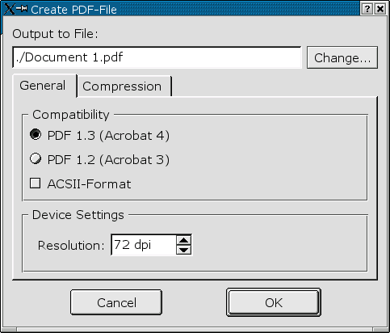
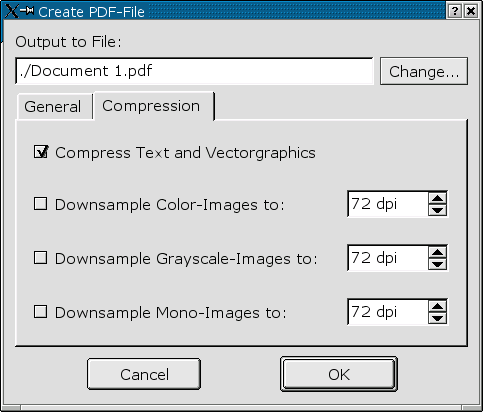
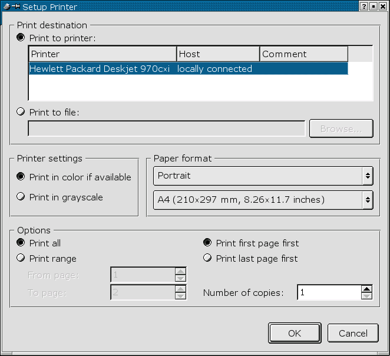

# 3.4 Die Ausgabe

Sie haben mehrere Möglichkeiten, fertige Scribus-Dokumente oder einzelne Elemente zur weiteren Verarbeitung
auszugeben. An dieser Stelle soll auch auf das Kapitel "Drag & Drop" verwiesen werden.

Die Ausgabe-Funktionen im Einzelnen:

## 3.4.1 Text-Export

Über den Menüpunkt _File / Save Text ..._ können Sie den Text eines einzelnen Rahmens in eine Text-Datei
im ASCII-Format exportieren. Dieser Menüpunkt steht Ihnen nur zur Verfügung, wenn ein Textrahmen angewählt ist.
Bitte beachten Sie: Exportieren Sie einen mit anderen Textrahmen verknüpften Rahmen, so wird _nur_ der im jeweils
ausgewählten Rahmen enthaltener Text exportiert!

## 3.4.2 EPS-Export

Komplette Scribus-Seiten lassen sich mittels _File / Save page as EPS .._ in eine EPS-Datei (Encapsulated Postscript) exportieren.
Hierbei wird, wie im EPS-Format üblich, nur die aktuell ausgewählte Seite exportiert.

## 3.4.3 PDF-Export

Das "Portable Document Format" (PDF) von Adobe hat sich in den letzten Jahren als Standard-Austausch-Format
im Publishing-Bereich entwickelt. Auch im Internet ist das PDF-Format aufgrund seiner Plattformunabhängigkeit
sehr beliebt.

Komplette Scribus-Dokumente lassen sich über _File / Save as PDF_ in PDF-Dokumente exportieren:

Legen Sie hier den Dateinamen, den jeweiligen Kompatibilitätsmodus (Acrobat 1.3 bzw. 1.4 oder ASCII-Format)
sowie die Auflösung der zu erstellenden PDF-Datei fest.

Unter _Compression_ können Sie festlegen, ob und wenn ja welche Elemente des Dokuments komprimiert
werden sollen:

In den gezeigten Eigenschaften werden Text und Vectorgraphiken komprimiert. Farbige-, Graustufen- bzw.
einfarbige Bilder werden allerdings in der Auflösung nicht geändert.

## 3.4.3 Druckausgabe

Zu guter letzt können Sie ein Scribus-Dokument natürlich auch direkt über einen lokal angeschlossenen
bzw. einen Netzwerkdrucker ausgeben. Hier stehen Ihnen alle unter QT üblichen Optionen zur Verfügung:

