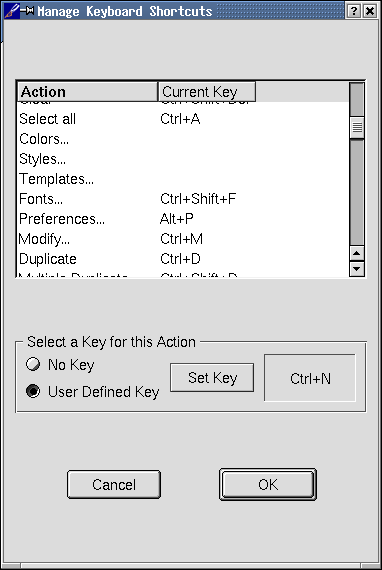

# Screen Shots of Scribus

These screen captures are based on the latest 0.7.4 version of Scribus with Qt3.
Note the ease of use and wide variety of options for modifying text
frame. The extras menu also offer many choices for applying tool
options, frames and guides, all of which can be enabled individually.

The Main Scribus Desktop with QT and KDE themes (IceWm) and Mosfet's Liquid enabled (new in 0.7). New in 0.7.2 is a status bar on the bottom,along with new easy to use polygon shapes.

This is the new document dialog.  Note you can have facing pages to view your layout.

This is one of the four tabbed dialog boxes for exporting to PDF. The PDF
dialogs are straightforward and easy to understand.

This
is the second dialog box setting font embedding options. Scribus is
very reliable at PDF exporting and embedding fonts ensures your
layout looks exactly as intended.You can combine both True Type and
Type 1 fonts in the same document.

This
is the modify picture frame dialog showing many of the options
available including the color management options which are
indivudally selectable for each image. Notice the precision with
which you can scale, rotate or position images.

This
is the modify Text Frame Dialog. A text frame can be used for
annotating PDF's, creating PDF bookmarks, printable text or for non
printing comments to display with the file. Text frames can have
sqaure or rounded corners and are vector based so they scale well and
print precisely as intended.

Below
is the scrap book palette. One _right_ drags
an item into the scrap book for using frequently used items.
Scrapbook items can be an image, a specially shaped graphic or a text
item. A scrapbook exists independent of each file, so the same
scrapbook can be used with many different files.

This
shows the text tool selected with type handling options. Notice the
manual kerning and type spacing options which give the designer
complete control of spacing and positioning.

This dialog box shows the keyboard shortcuts which are user
definable. Even menu item can have its own keyboard shortcut.

Updated 11 June 2002