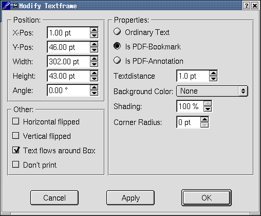

These screen captures are based on the latest 0.9.x versions of Scribus based on the stable 0.8 release.
Scribus is both easy to use and powerful. Version 0.9.6 has added whole bunch of advanced printing
capabilities, including PS Level 3 support, PDF/X-3 compatibility and many small but important touches
which make it easier and more productive. Moreover, it is becoming more stable even with new features added in.

Note the ease of use and wide variety of options for modifying text
frame. The extras menu also offer many choices for applying tool
options, frames and guides, all of which can be enabled individually.

The updated online <a href="index.html"><b>Help Documents for Scribus are here.

A peek at the future: <a href="/web/20030801143145/http://home.comcast.net/~scribusdocs/keramik.html"><b>Screen Shots and operating notes for Scribus on Red Hat 8.0 final</b></a>

The Main Scribus Desktop with QT and new Keramik KDE themes.

This is the updated new document dialog.  There are 25 + document sizes including most Standard A, B and US paper sizes for your layout. 

These are the recently added page pallete dialogs. This makes managing and applying page templates a drag and drop affair. Simply save a specific page with the margins and features you want in your layout. Save as a template and then from this panel drag and drop it on the pages you wish to apply the template to. 

This is one of the seven tabbed dialog boxes for exporting to PDF. The PDF 
dialogs are straightforward and easy to understand. PDF creation can include: PDF/X-3,interactive PDF forms,
Annotations, Bookmarks, PDF 1.3,PDF 1.4 and 128 bit encryption.

This is the second dialog box setting font embedding options. Scribus is
very reliable at PDF exporting and embedding fonts ensures your
layout looks exactly as intended .You can combine both True Type and
Type 1 fonts in the same document. 

This is the main color management panel which shows the new preview options in littlecms 1.09, including gamut checking and softproofing in the printer's color space. This has been greatly enhanced in 0.7.5+

This is the modify picture frame dialog showing many of the options
available including the color management options which are
indivudally selectable for each image. Notice the precision with
which you can scale, rotate or position images. 

This is the modify Text Frame Dialog. A text frame can be used for
annotating PDF's, creating PDF bookmarks, printable text or for non
printing comments to display with the file. Text frames can have
sqaure or rounded corners and are vector based so they scale well and
print precisely as intended.

Below is the scrap book palette. One _right_ drags
an item into the scrap book for using frequently used items.
Scrapbook items can be an image, a specially shaped graphic or a text
item. A scrapbook exists independent of each file, so the same
scrapbook can be used with many different files.

This shows the text tool selected with type handling options. Notice the
manual kerning and type spacing options which give the designer
complete control of spacing and positioning.

This dialog box shows the keyboard shortcuts which are user
definable. Even menu item can have its own keyboard shortcut. 

Updated 15 January 2003
