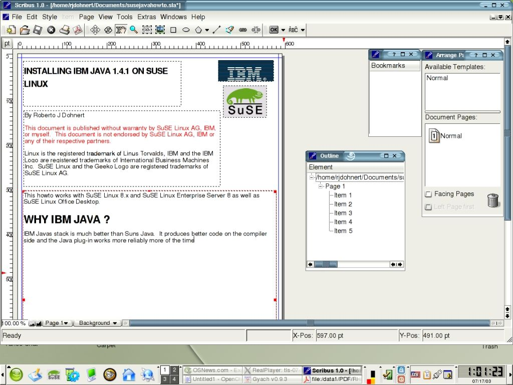

# Review of SCRIBUS 1.0 - a Free DTP for UNIX

Retrieved from <http://www.osnews.com/story/4064>

On July 15, 2003 the Scribus project had a milestone release. They released Scribus 1.0. I have used Scribus both personally and professionally since the early development times. 8.0 was when I first used it. 1.0 came with so many bug fixes and has become so refined I decided to do a review of it.

## What is Scribus?

[Scribus](http://web2.altmuehlnet.de/fschmid) is a open source Desktop Publishing Lapp. It is written in QT so it can run on a variety of Operating Systems. It is developed by Franz Schmid and his team of many contributors.

Scribus is meant to one day replace Adobe InDesign, Quark Express and if it continues on its current path it will meet its goal.

## Installing Scribus

Click for a larger view Scribus does not have any prebuilt RPM's or binary packages available for it. The source code is downloaded and easy to configure and make. But for some people RPM's or . Debs are an efficient way of installation. The configure script looks for QT 3.0.3 at least, CUPS, Tifflib, FreeType2 and LittleCMS. It is good to have these but CUPS and LittleCMS are not required, but you will not be able to utilize all the features of Scribus without them. SuSE Linux 8.x has all the necessary packages and they are installed by default, but Red Hat Linux and Debian Linux do not have TiffLib or Little CMS and they need to be downloaded and installed. LittleCMS packages can be downloaded from here.

To install CUPS and QT on Red Hat install the KDE Desktop and KDE Developer packages. I have compiled Scribus for SuSE Linux 8.1 and 8.2, Yellowdog Linux 3.0 and Red Hat Linux 9. There are some reports that Scribus can be installed on Mac OS X through Fink, although I have not tested it or had a look yet. There are efforts to port Scribus to Cygwin and Windows 2000 Professional. Basically any machine that you have that has QT on it you can compile Scribus.

## Features of Scribus

Scribus has a very clean interface and very easy to learn. Scribus has some professional publishing features, such as CMYK color, create PDFs easily, Encapsulated Postscript import/export. Graphics formats that can be utilized by Scribus are, jpeg, PNG and Xpixmap. One feature that I like is that the Scribus file format is based on XML, meaning that if you have a document that got damaged you can recover some of that document using a text editor. You can also embed fonts into PDF. PDF/X-3 files and you can assign presentation effects and you can encrypt PDF's. You can create Python scripts for Scribus and you can import and export SVG's. With PDF's it can also handle transperencies. Scribus as of 1.0 now has the Multiple Document Interface, where you can work on multiple documents at one time.

## Performance

I found Scribus 1.0 to work very well in comparison to the developer builds. Everything worked properly as they were supposed to. I had no adverse effects and no unexplained crashes. It loads rather quickly and all the fonts on my system were picked up and ready for use by Scribus. All the distributions I tried Scribus on, it worked well except for Red Hat 9. I had problems with Font rendering, but after a visit to the mailing list, I found out that it is a Red Hat problem with its font engine. Printing with Scribus was handled very well. It kept everything in format and the output looks professional.

## Peeves

As usual with all software, everyone has their pet peeves or things they would like to see changed or added. The major peeve I had was with the tool bar icons. They look old. They are the same Icons that you would see with KDE 1 or KDE 2, this makes the Application look dated. They should update the tool bar icons to something more modern, either crystal or an aqua type theme.

## Uses for Scribus

To be honest, I do not see Quark Express users or Adobe InDesign users flocking to Scribus. But, if you use PageMaker or Microsoft Publisher, then you will find similar functionality to Scribus and will probably find Scribus to be a great alternative. I use it personally to create all the howtos on my site. Professionally my company uses Scribus to create our brochures and press releases and we use it to create our customer manuals, basic lightweight Desktop Publishing. Schools and Churches who also do lightweight publishing and are on a tight budget and cannot see spending, hundreds to thousands of dollars on a commercial product , will find this tool very useful. If you work on Magazines or newspapers or are a professional publisher, I suggest you wait. One of the things I have heard is that Scribus does not import or export Quark or InDesign files, but I have never had a lot of luck in that department with the commercial products anyway.

## Conclusion

I was very pleased with this application. This application is another step in the right direction. While it may not be ready for Quark or InDesign users, give it time. It will only be getting better. Massive Linux adoption on the desktop is becoming closer to a reality and products like Scribus and OpenOffice are only going to make the transition a lot easier for some people.

## About the Author:
Roberto J. Dohnert is a Unix/Linux Consultant and software developer. His first introduction to UNIX based systems dates back to NEXTSTEP. He is a member of the GNU Darwin Distribution and has made several contributions to that and other projects. His personal webpage is here.

